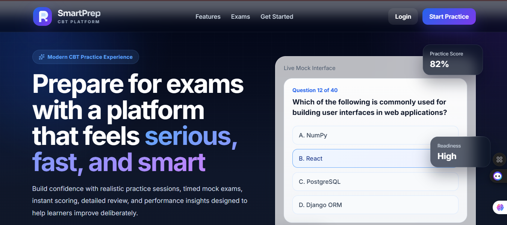
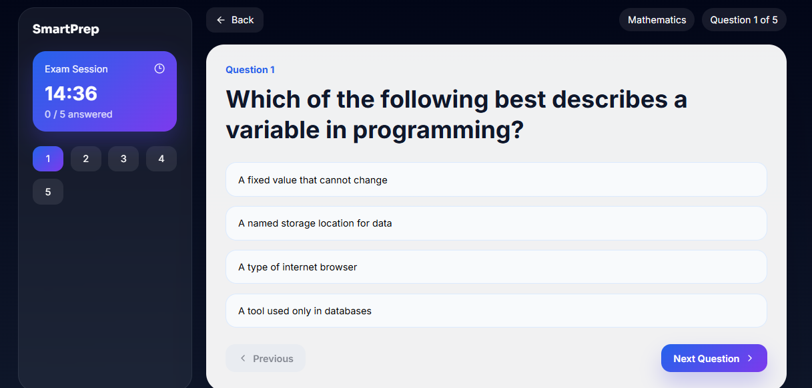
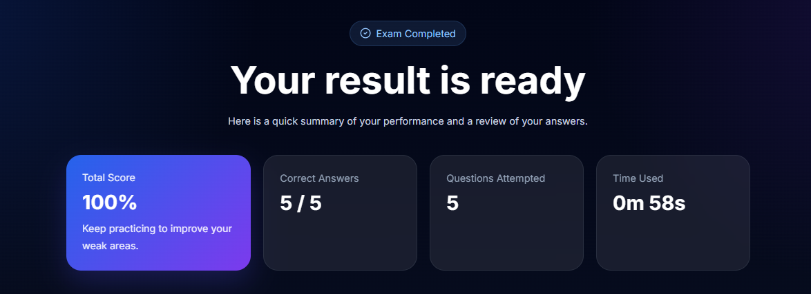

# SmartPrep CBT Platform

A modern **Computer-Based Testing (CBT) platform** built with **React, TypeScript, and Vite**.

SmartPrep simulates a real digital examination environment similar to systems used for **JAMB, WAEC, and Post-UTME exams**, providing an interactive exam interface, countdown timer, scoring engine, and result review system.

---

# Live Demo

*https://smart-prep-gamma.vercel.app/*

---

# Project Overview

SmartPrep is a fully responsive CBT web application that demonstrates:

- interactive exam workflow
- question navigation system
- auto scoring logic
- timer-controlled exams
- result review interface
- admin dashboard UI

The goal of this project is to demonstrate **clean React architecture, UI design, and application logic**.

---

# Features

## Interactive Exam Engine

- Question navigation
- Next / Previous question controls
- Question palette
- Answer selection tracking

---

## Countdown Timer

- Timed exam sessions
- Automatic submission when time expires
- Time used displayed on result page

---

## Question Randomization

Each exam session randomly shuffles the question order to simulate a realistic testing experience.

---

## Result Review System

After submission, users can:

- view their final score
- see percentage performance
- compare answers with correct solutions
- review all attempted questions

---

## Authentication UI

Frontend pages for:

- Login
- Signup

These demonstrate authentication interface flows.

---

## Admin Dashboard

A simulated admin interface including:

- student statistics
- exam activity
- quick actions
- analytics cards

---

## UI Enhancements

- glassmorphism design
- responsive layout
- dark/light theme toggle
- mobile navigation menu
- animated progress bar
- instruction modal before exam

---

# Screenshots

## Home Page

---

## Exam Interface

---

## Result Page

---

# Tech Stack

## Frontend

- React
- TypeScript
- Vite

---

## UI / Styling

- CSS
- Glassmorphism UI
- Lucide Icons

---

## Routing

- React Router DOM

---

## Development Tools

- Node.js
- npm
- VS Code

---

# Project Structure
src
├─ app
│ ├─ App.tsx
│ └─ routes.tsx
│
├─ components
│ ├─ Navbar.tsx
│ ├─ BrandLogo.tsx
│ ├─ ThemeToggle.tsx
│ ├─ HeroSection.tsx
│ ├─ FeaturesSection.tsx
│ ├─ CTASection.tsx
│ └─ Footer.tsx
│
├─ pages
│ ├─ HomePage.tsx
│ ├─ LoginPage.tsx
│ ├─ SignupPage.tsx
│ ├─ ExamPage.tsx
│ ├─ ResultPage.tsx
│ └─ AdminDashboardPage.tsx
│
├─ data
│ └─ questions.ts
│
├─ styles
│ ├─ global.css
│ ├─ home.css
│ ├─ exam.css
│ ├─ result.css
│ ├─ auth.css
│ └─ admin.css
│
└─ main.tsx
# Getting Started

## Clone the repository

git clone https://github.com/yourusername/smartprep-cbt.git

---

## Navigate to project folder

cd smartprep-cbt

---

## Install dependencies

npm install

---

## Run the development server

# Getting Started

## Clone the repository

git clone https://github.com/yourusername/smartprep-cbt.git

---

## Navigate to project folder

cd smartprep-cbt

---

## Install dependencies

npm install

---

## Run the development server

npm run dev

The app will run at:

---

# Future Improvements

Possible enhancements include:

- backend authentication
- database-driven question bank
- exam creation panel
- real analytics dashboard
- user progress tracking
- leaderboard system
- difficulty-based question filtering

---

# Deployment

This project can be deployed using:

- **Vercel**
- **Netlify**
- **GitHub Pages**

Recommended:
Vercel

---

# Author

**Prosper Kayode**
  
Frontend Developer | Data Analyst

---

# License

This project is licensed under the MIT License.
